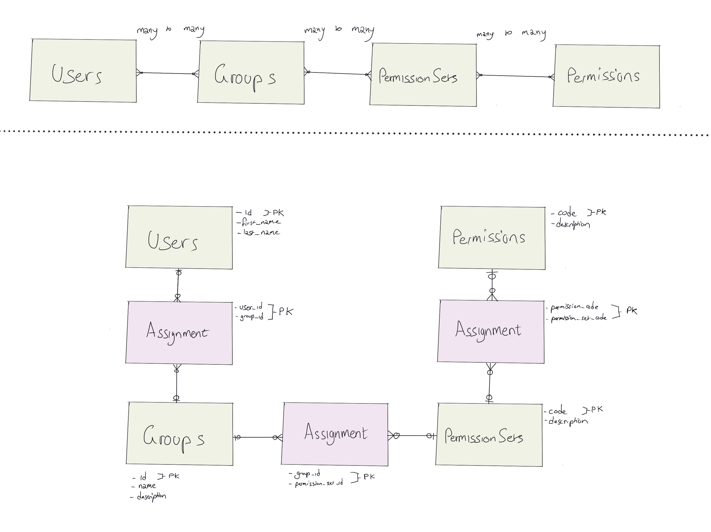

# Diesel IAM poc

This is a test project to create an Identity and Access Management (IAM) implementation using rust and diesel.

## Features

- Users and groups use UUID primary keys.
- Automatic timestamps for `created_at` and `updated_at`
- Soft delete on entities by using `deleted_at` fields
- TODO: [Cascading soft deletes](https://stackoverflow.com/questions/506432/cascading-soft-delete/53046345#53046345) for weak entity tables

## Data model



## Quick Start

## Install pre-requisites

- [`rustup`](https://rustup.rs/)
- [`diesel_cli`](https://diesel.rs/guides/getting-started#installing-diesel-cli)

### Commands

```sh
# Start the debstack (postgres & pgadmin in docker-compose.yml)
make devstack.start

# Run migrations
diesel migration run

# Seed DB with data
cargo run --bin seed_iam_data

# Update all users names (useful to check automatic update_at field working)
cargo run --bin seed_update_users

# List all tables with data
cargo run --bin list_all
```
