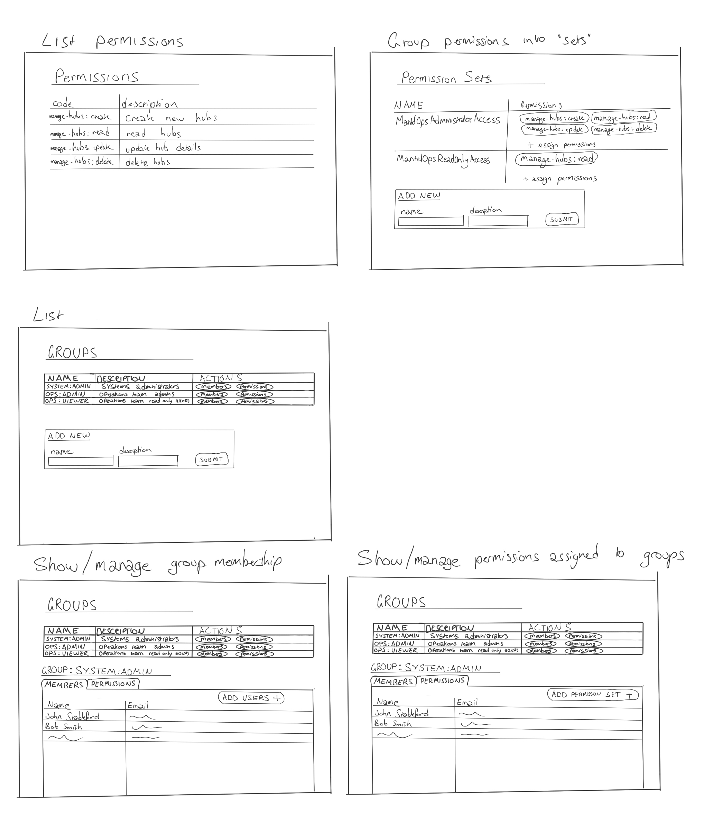
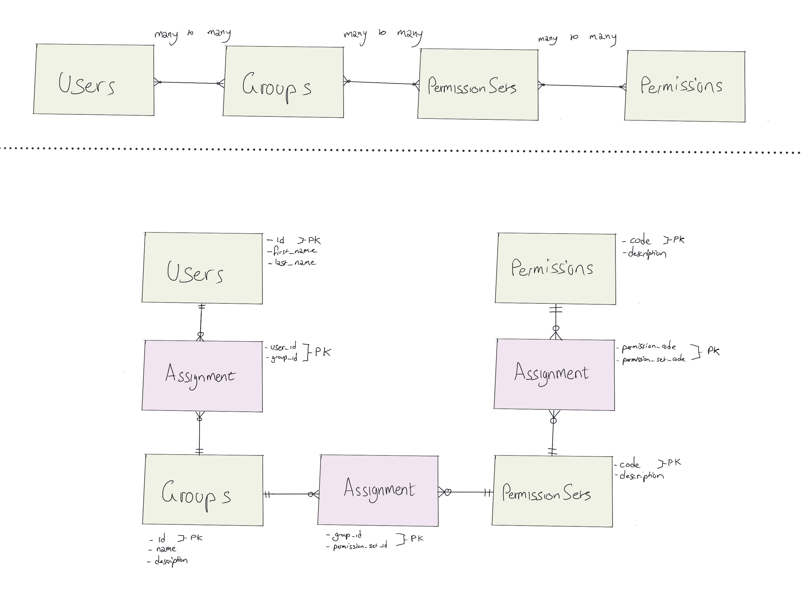

# IAM data model

The purposes of the IAM data model demonstrated in this repo is

There are a set of DB tables that come together to form the basis of the IAM system demonstrated in this repository, they are:

- users - identifies one unique user
- user_groups - collections of users
- permission - represents permission for a single action that the system supports
- permission_sets - is a collection of individual permissions grouped together that can be assigned to groups

## Goals

- Facilitate fine grained permissions for any action in the system
- Group individual permissions into logical sets so that they can be assigned all at once for common role types
- Assign all access based on a user's membership to different groups

## Wireframes

## ERD

